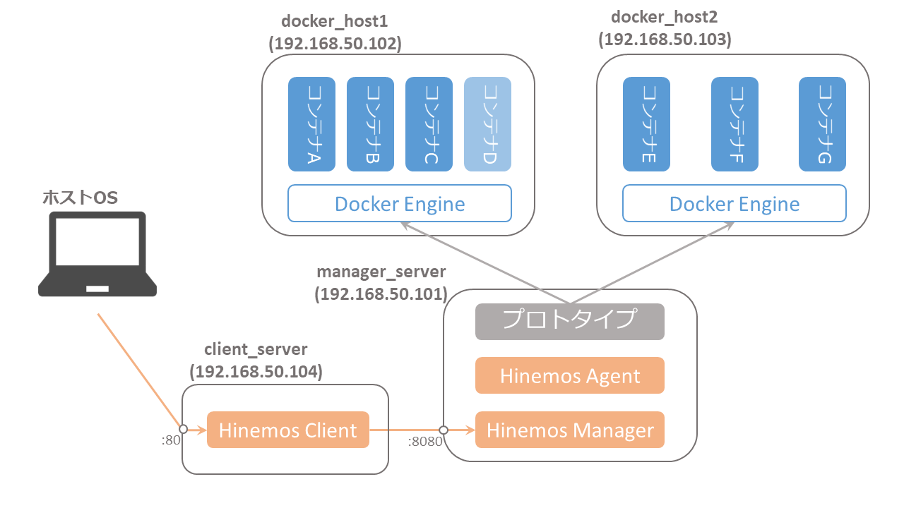

# インストール方法

## 事前準備

### VirtualBox のインストール
* VirtualBox をインストール

	https://www.virtualbox.org/wiki/Downloads

### Vagrant のインストール
* Vagrant をインストール

	https://www.vagrantup.com/downloads.html

	```
	$ vagrant -v
	```
* Vagrant プラグインをインストール

	```
	$ vagrant plugin install vagrant-hosts
	$ vagrant plugin install vagrant-reload
	$ vagrant plugin install vagrant-vbguest
	```

### リポジトリをクローン
* 任意のディレクトリ（例：ホームディレクトリ）に移動し、git リポジトリをクローン

	```
	$ git clone https://github.com/muroya2355/hinemos_docker.git
	```

* リポジトリに移動

	```
	$ cd hinemos_docker
	```

### サンプルスクリプトを配置
* Hinemos 公式サイトから、サンプルスクリプトの圧縮ファイルをダウンロード

	https://www.hinemos.info/themes/custom/hinemos/download/hinemos_docker_sample_v1.0.0.tar.gz


* ファイルを hinemos_docker/vagrant/shared/manager_server に配置

	```
	$ ls ./vagrant/shared/manager_server
	hinemos_docker_sample_v1.0.0.tar.gz
	```


## 環境構築

### 仮想マシン作成
* Vagrant の実行
	
	```
	$ cd ./vagrant
	$ vagrant init
	```
	⇒ エラーが出なければOK

### マネージャーサーバーを Hinemos に登録
* ブラウザから Hinemos Web クライアントにアクセス
	
	http://192.168.50.104/

* 

### Docker コンテナの作成
* 

### Docker コンテナを Hinemos に登録
*


# 環境
## Linux サーバ一覧


| ホスト名 | OS | IPアドレス | 用途 |
| :- | :- | :- | :- |
| manager_server | CentOS7 | 192.168.50.101 | Hinemosマネージャ・エージェント，サンプルスクリプトをインストール |
| docker_host1 | CentOS7 | 192.168.50.102 | Docker が動作するサーバ |
| docker_host2 | CentOS7 | 192.168.50.103 | Docker が動作するサーバ |
| client_server | CentOS7 | 192.168.50.104 | Hinemos webクライアントが動作するサーバ |